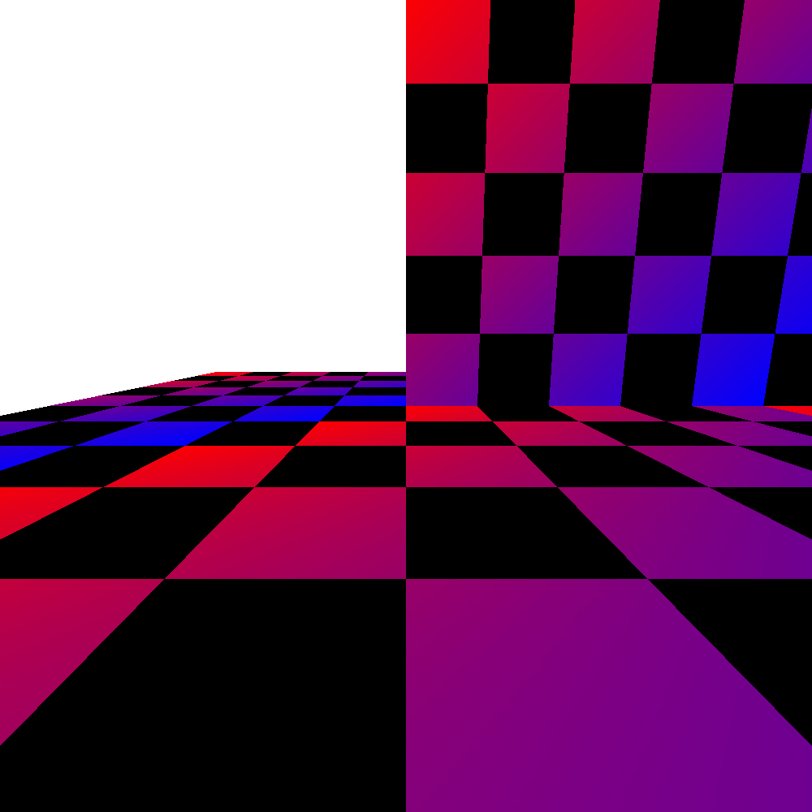
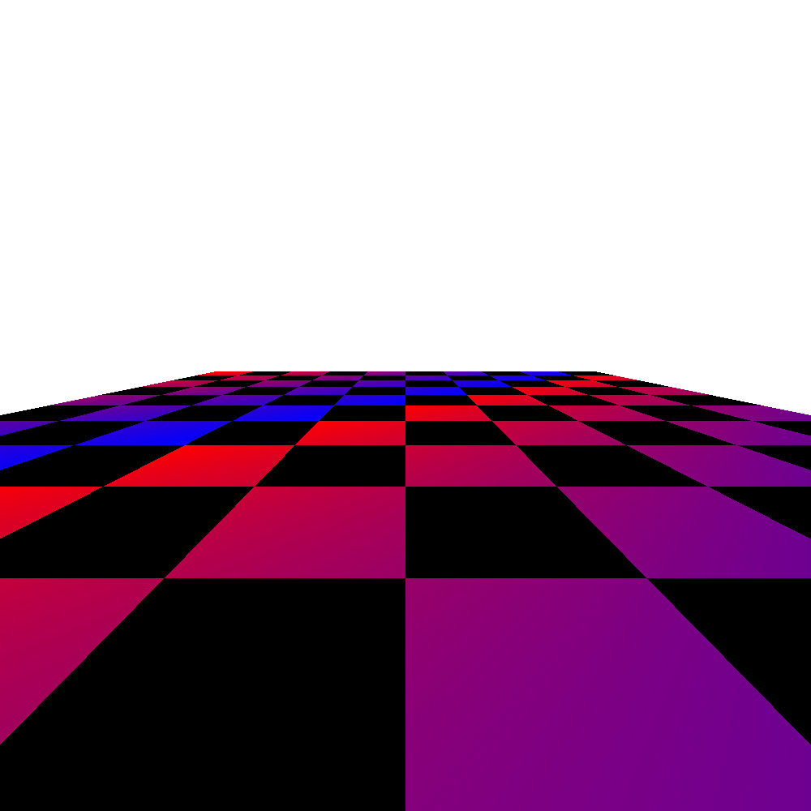
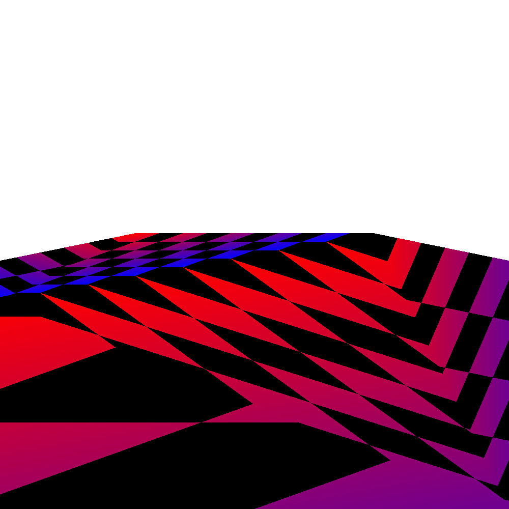

# Rendering Pipeline

## Overview

This small project was realized to better understand the 3D graphics pipeline and also to practice template programming in C++. It is made of:

* ```utils/matrix.hpp``` implements a "static" matrix class using templates. Matrix size must be known at compile time. It also contains a few helper functions for creating transformation matrices.
* ```utils/stb_image_write.h``` from [stb](https://github.com/nothings/stb), used to export arrays as images.
* ```main.cpp``` implements the rendering pipeline. The scene is hard-coded and composed of two planes. First, the planes are transformed into clip space. This is followed by backface culling and frustrum clipping, and the resulting vertices are converted to window space. Fragments are created during rasterization. The color of the fragments is calculated by the fragment shader. Finally, the fragments are written to the frame buffer.

Clipping is performed using the Sutherland-Hodgman algorithm, and the resulting polygon is converted into triangles by cutting it in a triangles fan. Rasterization is perfomed by testing each pixel within the AABB of the projected triangles, and fragments attributes are computed using perspective-correct interpolation. For more information on the theory please refer to the file: ```notes.pdf``` (handwritten notes in french).

This project was done in C++.

|  |  |  |  |
|:--:|:--:|:--:|:--:|
| *Resulting image of ```./main```* | *Resulting image of ```./main -s 10 -t 90```* | *Resulting image of ```./main -s 10 -t 270``` (backface culling is perfomed)* | *Without perspective-correct interpolation (can see the triangles fan)* |

## Setup

The installation process is simple: simply compile the ```main.cpp``` file: ```g++ -std=c++17 main.cpp -o main```. To render the scene at a scale of 10 and with one of the two planes rotated by 90°, use the command: ```./main -s 10 -t 90```.